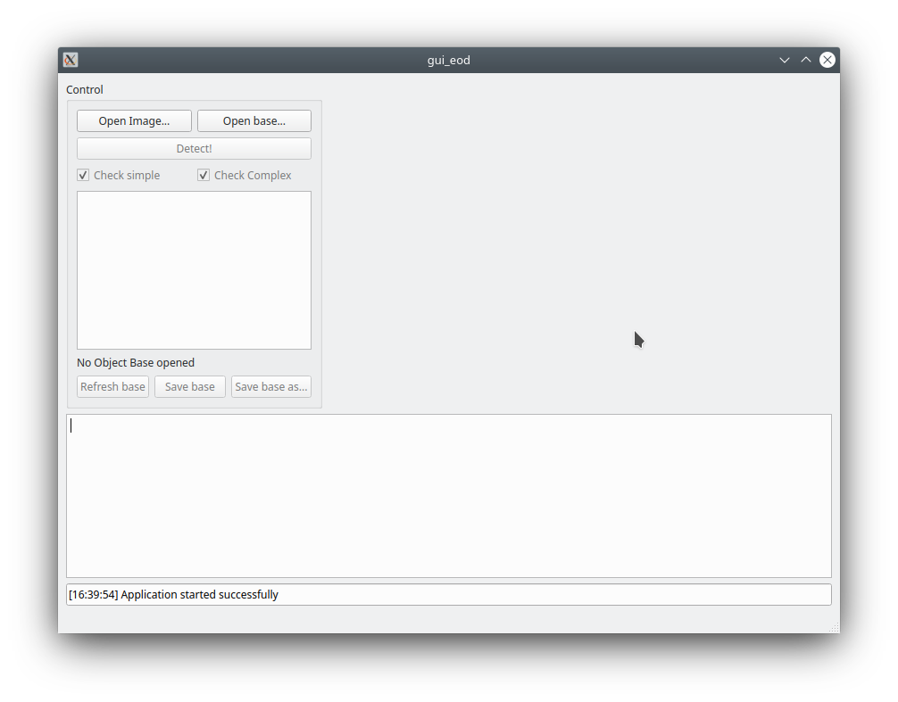
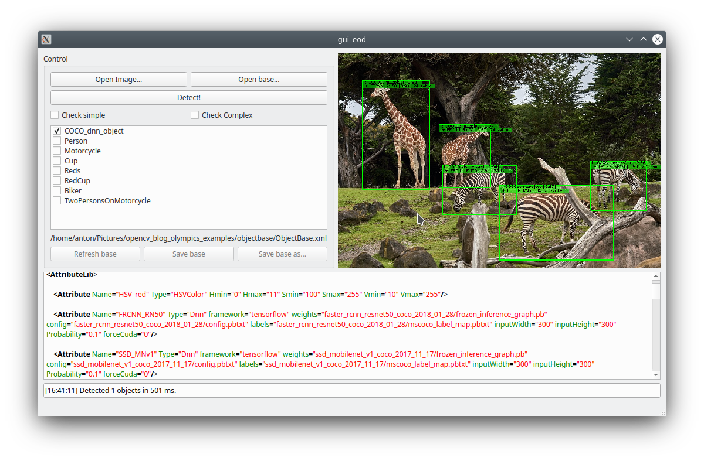

# QT GUI for Exteneded Object Detection
[](https://github.com/Extended-Object-Detection-ROS/qt_gui_eod/issues) [](https://opensource.org/licenses/BSD-3-Clause)   

Allows:
 - See and save results of object detection on static images
 - Edit and save object bases (XML-files with object descriptions)
 - Choose subset of objects for detection
 





# Install 
(tested on Linux Kubuntu 20.04 LTS with installed OpenCV 4.2.0)

1. Clone this repository locally (last release)
```bash
git clone --recurse-submodules https://github.com/Extended-Object-Detection-ROS/qt_gui_eod -b r1.0.0
```
2. (Optional) Install igraph for Complex Objects detection
```bash
mkdir tmp
cd tmp
curl -O https://igraph.org/nightly/get/c/igraph-0.7.1.tar.gz
tar -xzf igraph-0.7.1.tar.gz
rm igraph-0.7.1.tar.gz

sudo mv igraph-0.7.1 /usr/local/src/
cd /usr/local/src/igraph-0.7.1
./configure
make
make check
sudo make install
```
In CMakeLists.txt at 19 line change on:
```cmake
set(igraph ON)
```
3. Open CMakeLists.txt in qt-creator, build and run program

